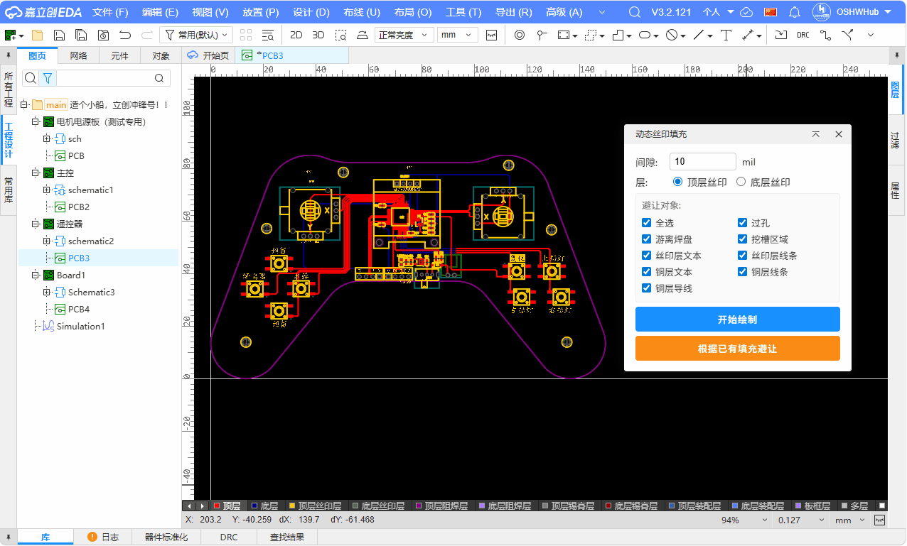
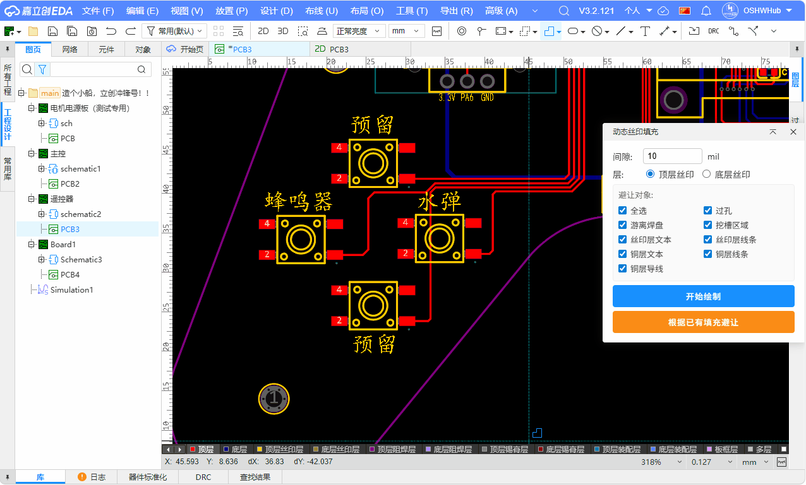

# Dynamic Silkscreen Fill Region Extension

### Features

Draw polygon fill regions on PCB silkscreen layers with automatic obstacle avoidance.

- **Interactive Drawing**: click to add vertices, Enter to finish, Esc to cancel
- **Auto Avoidance**: auto-collects 6 obstacle types, expanded by gap, overlapping regions merged
- **Fill-based Avoidance**: select existing silkscreen fill, one-click automatic avoidance
- **Boolean Operations**: final fill via polygon boolean difference (outer CW + holes CCW)
- **Dual Layer**: supports top silkscreen (Layer 3) and bottom silkscreen (Layer 4)

### Usage

**Option 1: Draw New Fill**
1. Open a PCB document in EasyEDA Pro
2. Menu: **Dynamic Silkscreen Fill** > **Draw Dynamic Fill...**
3. Enter gap value, click "Start Drawing"
4. Click on canvas to pick polygon vertices
5. Press Enter to finish — fill is generated automatically

**Option 2: Avoid Existing Fill**
1. Select a silkscreen fill region (rectangle, circle, etc.)
2. Click "Avoid Existing Fill"
3. Automatic avoidance processing

### Dependencies

- **polyclip-ts** - Martinez-Rueda-Feito polygon boolean operation algorithm (MIT License)

### License

Apache-2.0
