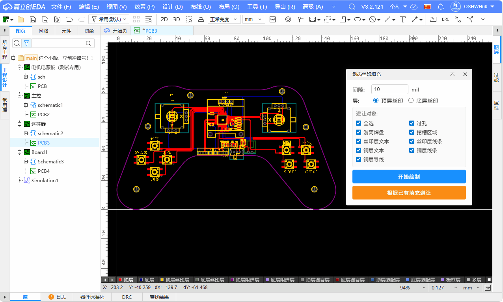
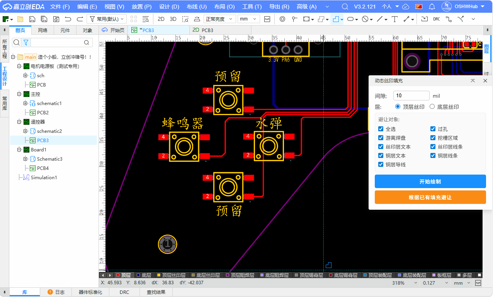

# 动态丝印填充扩展 / Dynamic Silkscreen Fill Region Extension

[中文](#中文) | [English](#english)

---

## 中文

### 功能特性

在PCB丝印层绘制多边形填充区域，自动挖除障碍物（焊盘、位号、过孔、文本、挖槽区域等）。

- **交互式绘制**：点击画布拾取多边形顶点，Enter完成，Esc取消
- **自动避让**：自动收集6类障碍物，障碍物按间隙外扩，重叠区域自动合并
- **填充避让**：选中已有丝印层填充区域，一键自动避让（支持圆形/矩形/多边形）
- **布尔运算**：多边形布尔差集生成最终填充（外轮廓CW + 洞CCW）
- **双层支持**：支持顶层丝印（Layer 3）和底层丝印（Layer 4）

### 使用方法

**方式一：绘制新填充**
1. 在EasyEDA Pro中打开PCB文档
2. 选择菜单：**动态丝印填充** > **绘制动态填充...**
3. 输入间隙值，点击"开始绘制"
4. 在画布上点击拾取多边形顶点
5. 按 Enter 完成绘制，自动生成填充  

**方式二：根据已有填充避让**
1. 选中丝印层的填充区域（矩形、圆形等）
2. 点击"根据已有填充避让"按钮
3. 自动完成避让处理  

### 技术依赖

- **polyclip-ts** - Martinez-Rueda-Feito 多边形布尔运算算法（MIT 许可证）

### 许可证

Apache-2.0

---

## English

### Features

Draw polygon fill regions on PCB silkscreen layers with automatic obstacle avoidance.

- **Interactive Drawing**: click to add vertices, Enter to finish, Esc to cancel
- **Auto Avoidance**: auto-collects 6 obstacle types, expanded by gap, overlapping regions merged
- **Fill-based Avoidance**: select existing silkscreen fill, one-click automatic avoidance
- **Boolean Operations**: final fill via polygon boolean difference (outer CW + holes CCW)
- **Dual Layer**: supports top silkscreen (Layer 3) and bottom silkscreen (Layer 4)

### Usage

**Option 1: Draw New Fill**
1. Open a PCB document in EasyEDA Pro
2. Menu: **动态丝印填充** > **绘制动态填充...**
3. Enter gap value, click "开始绘制"
4. Click on canvas to pick polygon vertices
5. Press Enter to finish — fill is generated automatically  

**Option 2: Avoid Existing Fill**
1. Select a silkscreen fill region (rectangle, circle, etc.)
2. Click "根据已有填充避让"
3. Automatic avoidance processing  

### Dependencies

- **polyclip-ts** - Martinez-Rueda-Feito polygon boolean operation algorithm (MIT License)

### License

Apache-2.0
